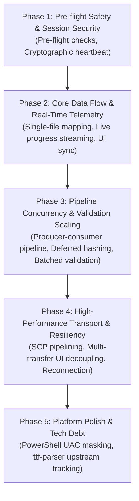

# Simply Transfer V2 - Task Hierarchy & Phase Progression

This document defines the structured development hierarchy and phase progression for Simply Transfer V2, derived from the project roadmap, architecture requirements, and live issue triage.

Items are evaluated and sequenced across three core axes:
* **Necessity:** From Critical Core (P0) to Technical Debt (P3).
* **Dependencies:** Structural and algorithmic prerequisites that must be in place first.
* **Level of Difficulty / Resource Expenditure:** From low-risk, self-contained fixes to high-expenditure architectural decoupling.

---

## 1. Item Evaluation Matrix

| Item | Necessity | Dependency / Prerequisites | Difficulty / Expenditure | Status |
| :--- | :---: | :--- | :---: | :--- |
| **Strict Pre-flight Checks** | P0 | OOB Handshake, Key Ingestion | **Low** | ✅ Implemented |
| **Cryptographic Heartbeat** | P0 | Verified SSH Keys | **Low** | ✅ Implemented |
| **UI Progress Streaming** | P0 | Transfer Engine Scaffolding | **Medium** | ✅ Implemented |
| **Single File vs Directory Mapping** | P0 | Relative Path Resolver | **Low** | ✅ Implemented |
| **Producer-Consumer Transfer Pipeline** | P1 | Async Engine Scaffolding | **Medium** | ✅ Implemented |
| **Instantaneous Destination Validation** | P1 | Deferred Hashing | **Medium** | ✅ Implemented |
| **Batch Remote Validation (50 files/cmd)** | P1 | SSH Command Execution | **Low** | ✅ Implemented |
| **Transport Efficiency Profiling** | P1 | Pipelined Protocol (SCP vs SFTP) | **Medium** | ✅ Implemented |
| **Multi-transfer UI State Decoupling** | P2 | Slint UI Session Isolation | **High** | 🛑 Open ([Issue](FUTURE_ISSUE_MULTITRANSFER_SETUP.md)) |
| **Network Resiliency & Reconnection** | P2 | Pipelined Engine & Chunk Resumption | **High** | 🛑 Open |
| **PowerShell UAC / Console Masking** | P3 | None (Current execution works) | **Low** | 🛑 Backlog ([Issue](FUTURE_ISSUE_POWERSHELL_PROMPT.md)) |
| **Replace `ttf-parser` Dependency** | P3 | Upstream Slint/Winit Ecosystem | **High** | 🛑 Backlog ([Issue](FUTURE_ISSUE_REPLACE_TTF_PARSER.md)) |

---

## 2. Five-Phase Progression Architecture

---

### Phase 1: Pre-flight Safety & Session Security
* **Objective:** Fail-fast before allocating transmission memory or pushing bytes over the wire.
* **Dependencies:** Working Out-Of-Band (OOB) TCP handshake and Ed25519 key ingestion.
* **Deliverables:**
  1. **Strict Pre-flight Checks:** Query destination disk space before file transfer begins; test destination `sshd` socket reachability on port 22.
  2. **Cryptographic Heartbeat:** Continuous peer verification during active sessions to ensure connection health and detect network disconnects or socket hijacking.
* **Resource Expenditure:** Low (standard socket probes and SSH credential checks).

---

### Phase 2: Core Data Flow & Real-Time Telemetry
* **Objective:** Ensure accurate, non-blocking telemetry and eliminate data corruption in basic file routing.
* **Dependencies:** Phase 1 stability and baseline engine event channels.
* **Deliverables:**
  1. **Single File Routing:** Correct path normalization when mapping isolated single files rather than directory trees (preventing empty destination paths / OS error 20).
  2. **Live Progress Streaming:** Transmit real-time upload speed (MB/s), duration, and ETA through `tokio::sync::mpsc` channels into the Slint UI event loop without blocking GUI rendering.
  3. **UI State Consistency:** Prevent active connection host overwrites during verification and ensure session lists accurately report connection names.
* **Resource Expenditure:** Medium (inter-thread communication between Tokio engine and Slint event loop).

---

### Phase 3: Pipeline Concurrency & Validation Scaling
* **Objective:** Eliminate the sequential 3-phase bottleneck (Validation -> Transmission -> Integrity Check) by enabling concurrent producer-consumer pipelines.
* **Dependencies:** Phase 2 data streaming and stable channel orchestration.
* **Deliverables:**
  1. **Producer-Consumer Engine:** Run reading/hashing, network streaming, and destination integrity validation concurrently across distinct worker tasks.
  2. **Deferred Local Hashing:** Defer source hashing to the finishing phase so destination file validation can begin instantaneously without waiting for whole-directory hash computation up front.
  3. **Batched Remote Validation:** Execute remote SHA-256 checks in batches of up to 50 files per SSH command to drastically reduce round-trip command execution overhead.
* **Resource Expenditure:** Medium (channel coordination and batch command string builders).

---

### Phase 4: High-Performance Transport & Resiliency
* **Objective:** Saturate Gigabit Ethernet links and allow concurrent multi-session configurations.
* **Dependencies:** Phase 3 pipelined engine and stable SSH2 backend.
* **Deliverables:**
  1. **Transport Efficiency Profiling:** Address SFTP synchronous per-chunk ACK bottlenecks; utilize pipelined SCP transfers with enlarged 64KB read/write buffers to reach 100+ MB/s over Gigabit LAN.
  2. **Multi-transfer UI Decoupling:** Decouple global UI setup models (`connections.json`, setup pickers) from active background transfers so users can configure Connection B while Connection A is actively transmitting.
  3. **Network Resiliency & Reconnection:** Add exponential backoff, socket re-negotiation, and byte-level resume for spotty or interrupted transfers.
* **Resource Expenditure:** High (deep architectural state separation and resumption logic).

---

### Phase 5: Platform Polish & Technical Debt
* **Objective:** Enhance platform-specific user experience and track upstream ecosystem maintenance.
* **Dependencies:** Operational Phases 1–4.
* **Deliverables:**
  1. **PowerShell UAC / Console Masking:** Hide visible external PowerShell console windows during Windows administrative key ingestion (`Start-Process powershell -Verb RunAs`).
  2. **Replace `ttf-parser` Dependency:** Monitor upstream `slint` / `winit` / `ab_glyph` dependencies to transition away from unmaintained `ttf-parser` (Advisory ID: `RUSTSEC-2026-0192`) when viable replacements emerge.
* **Resource Expenditure:** Low for Windows console masking; High for upstream font-parser ecosystem rewrites (best handled via upstream tracking).
